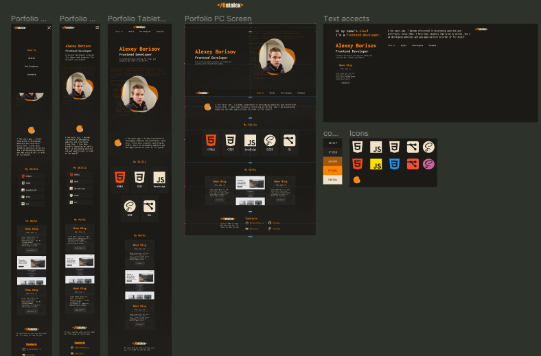

# Hello World

> Set up the project, the goal here is to master all of the tools and best practices about Linter and Gitflow.

Additional description about the project and its features.

## Built With
- Technologies used: 
### Html5, Css3, JavaScript

## Folow me 

- GitHub: [@Albinpirela](https://github.com/Albinpirela)
- Twitter: [@AlbinPirela1](https://twitter.com/AlbinPirela1)
- LinkedIn: [albin pirela](https://www.linkedin.com/in/albin-pirela-21528a222/) 

## 🤝 Contributing 

Contributions, issues, and feature requests are welcome!

Feel free to check the [issues page](../../issues/).

## Show your support

Give a ⭐️ if you like this project!

## Acknowledgments

- Hat tip to anyone whose code was used
- Inspiration
- etc

## 📝 License

This project is [MIT](./MIT.md) licensed.
